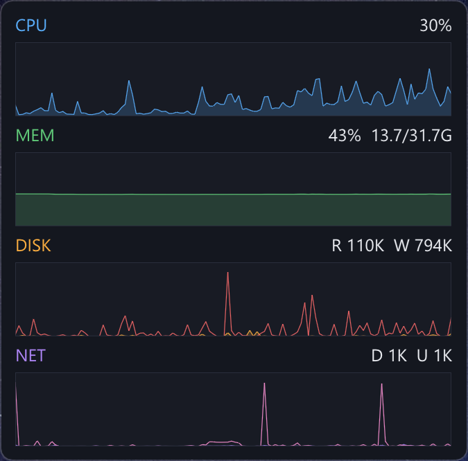

# Windows Resource Monitor Widget

一個常駐桌面角落的輕量級 Windows 即時資源監控小工具。目的很單純:**一眼看出電腦現在有沒有在工作**。

使用 **C++17** + **Dear ImGui** + **ImPlot** + **DirectX 11** 開發,啟動後停靠在螢幕右上角,以四條折線圖顯示最近一段時間的系統活動。

<p align="center"></p>

---

## 🚀 功能

*   **五項核心指標**,各一條時間軸折線圖(新資料由右側推進,預設保留 2 分鐘):
    *   **CPU**(藍)— 全系統平均使用率 (%) 與 **CPU 實體溫度** (攝氏度，依加載狀態著色)。
    *   **MEM**(綠)— 記憶體使用率 (%),右上顯示 已用/總量 GB(與工作管理員口徑一致)與 **DDR5 記憶體實體溫度**(讀取 DIMM 上的 SPD5118 溫度感測器,取最熱的一條)
    *   **DISK** — 磁碟讀取 R(橘)/ 寫入 W(紅)速率,自動以 KB/s、MB/s 顯示
    *   **NET** — 網路下載 D(紫)/ 上傳 U(粉)速率
*   **動態狀態著色** (針對 CPU 溫度呈現)：
    *   🟢 **綠色**：以系統管理員執行成功載入內核驅動程式，讀取**硬體暫存器實體真實溫度**。
    *   🟡 **橘黃色**：無管理員權限或硬體不支援，自動優雅降級為 **WMI 查詢** 或 **CPU 負載平滑模擬溫度**。
*   **內建驅動程式加載技術**：
    *   將 `WinRing0` 動態庫與核心驅動封裝在二進位資源中，小工具啟動時會在背景自動釋放並載入，維持**「單一執行檔、免手動安裝」**的好處。
*   **小巧不擾人**
    *   無邊框小視窗(300×296 邏輯像素),啟動時自動停靠工作區右上角
    *   **Compact 模式**:右鍵選單一鍵把長寬縮成 1/2,切換小字型與緊湊間距,右上角錨點不動
    *   永遠置頂(可關閉)、不佔工作列、不出現在 Alt-Tab
    *   Windows 11 圓角、完整支援高 DPI 縮放(字體與版面隨系統縮放,實測 225% 清晰)
*   **極低系統開銷**
    *   閒置 CPU:約單核心 0.8%(整機 < 0.1%)
    *   記憶體工作集:約 48 MB;執行檔:約 560 KB,單一檔案免安裝

## 🖱️ 操作

| 操作 | 效果 |
|------|------|
| 左鍵拖曳 | 移動視窗到任意位置 |
| 右鍵 | 選單:置頂開關、**Compact size (1/2) 縮小切換**、採樣間隔(0.5s / 1s / 2s,對應 1 / 2 / 4 分鐘視窗)、結束 |
| **以管理員執行** | **啟用實體硬體溫度讀取**(CPU 與 DDR5 記憶體;否則 CPU 溫度降級為黃橘色模擬值、記憶體溫度隱藏) |

### 開機自動啟動(選用)

按 `Win+R` 輸入 `shell:startup`,在開啟的資料夾中為 `build\Release\win_hardware_monitor.exe` 建立捷徑即可。若需要開機自動以管理員權限啟動，建議透過「Windows 工作排程器」建立一個以最高權限執行的登入工作。

---

## ⚙️ 建置

需求:Visual Studio 2022(含 C++ 桌面開發工作負載)。執行一鍵建置腳本:

```powershell
.\build.bat
```

或手動使用 CMake:

```powershell
cmake -G "Visual Studio 17 2022" -A x64 -B build
cmake --build build --config Release
```

執行檔輸出於 `build\Release\win_hardware_monitor.exe`。首次設定會由 CMake FetchContent 自動下載 ImGui 與 ImPlot,需要網路連線。

### 疑難排解

*   **CMake 報 cache 目錄不符**:專案資料夾搬移過位置時,舊的 `build/` 快取會記著原路徑。刪除整個 `build/` 資料夾重新建置即可。
*   **視窗看不到**:請勿為此視窗加上 `WS_EX_LAYERED`(分層視窗)——DXGI swap chain 無法合成到分層視窗上,視窗會完全不顯示(詳見 `src/main.cpp` 註解)。

---

## 🛠️ 技術說明

### 技術棧

*   C++17 (MSVC)、CMake 3.15+(FetchContent 管理依賴)
*   [Dear ImGui v1.90.8](https://github.com/ocornut/imgui) + [ImPlot v0.16](https://github.com/epezent/implot)
*   DirectX 11 + Win32 後端

### 數據來源

| 指標 | API / 機制 | 說明 |
|------|-----------|------|
| CPU | `GetSystemTimes` | 以 idle/kernel/user 時間的兩次採樣差值計算;單次呼叫,不逐核採樣 |
| CPU 溫度 | **內嵌式 WinRing0 (PCI/MSR)** | **AMD**: 寫入 PCI 暫存器指定 SMN `0x00059800` 位址，讀取 PCI 0x64 數值並扣除 49°C 偏移量。<br>**Intel**: 讀取 MSR `0x19c` (`IA32_THERM_STATUS`) 結合 MSR `0x1A2` 的 TjMax 計算實體核心溫度。<br>**Fallback 1**: 查詢 WMI `MSAcpi_ThermalZoneTemperature`。<br>**Fallback 2**: 依 CPU 負載平滑模擬算式 (`37°C + cpuPct * 0.45`)。 |
| 記憶體 | `GlobalMemoryStatusEx` | 已用 = 總實體記憶體 − 可用;與工作管理員「使用中」相同口徑 |
| 記憶體溫度 | **內嵌式 WinRing0 (SMBus)** | **AMD FCH 平台限定**:由 PM 暫存器(port `0xCD6/0xCD7`)取得 SMBus 控制器 I/O base,掃描 `0x50`–`0x57` 找 DDR5 **SPD5118** hub,讀 MR49/MR50 解碼溫度(JESD300,0.25°C 解析度)。**唯讀不寫 SPD**;交易前先取得 `Global\Access_SMBUS.HTP.Method` 互斥鎖,避免與 RGB/監控軟體衝突。讀不到(Intel、DDR4、無管理員權限)則直接隱藏,不做模擬值 |
| 磁碟 | PDH `\PhysicalDisk(_Total)\Disk Read/Write Bytes/sec` | 以 `PdhAddEnglishCounter` 加入計數器,中文等本地化 Windows 也能運作 |
| 網路 | `GetIfTable2` | 加總「實體且已連線」介面卡的 octet 計數差值;排除 loopback 與虛擬介面卡,避免同一流量重複計算 |

### 低開銷設計

*   **採樣執行緒**:獨立背景執行緒,預設 1 秒採樣一次;以 50ms 為單位的回應式 sleep,結束程式時能即時退出。
*   **閒置節流渲染**:主迴圈以 `MsgWaitForMultipleObjectsEx` 等待,無互動時約 2 FPS;任何輸入事件立即喚醒並提速至 60 FPS,拖曳不卡頓。
*   **環形緩衝區**:每項指標固定保留 120 筆歷史,無反覆動態記憶體配置;UI 執行緒透過互斥鎖取得快照,所有指標寫入皆在鎖內(執行緒安全)。
*   **編譯瘦身**:不編譯 ImGui/ImPlot demo 原始碼;版面固定,不產生 imgui.ini。

---

## 📁 專案結構

```
win_hardware_monitor/
├── CMakeLists.txt         # CMake 設定(FetchContent 下載 ImGui & ImPlot)
├── build.bat              # 一鍵編譯腳本(自動尋找 VS 2022)
├── WinRing0x64.dll        # 實體讀取所需的驅動程式動態庫 (發行版已內置二進位資源)
├── WinRing0x64.sys        # 實體讀取核心驅動程式 (發行版已內置二進位資源)
├── docs/screenshot.png    # 執行畫面
├── src/
│   ├── main.cpp           # Win32 無邊框視窗、D3D11 初始化、閒置節流主迴圈
│   ├── resource_ids.h     # 資源 ID 定義
│   ├── resources.rc       # 打包 WinRing0 DLL/SYS 的資源編譯檔
│   ├── system_monitor.h   # 環形緩衝區與監控執行緒宣告 (含 WinRing0 動態讀取介面)
│   ├── system_monitor.cpp # CPU / 記憶體 / 磁碟 / 網路 / 溫度採樣與優雅降級邏輯
│   ├── ui_renderer.h      # 小工具面板宣告
│   └── ui_renderer.cpp    # 四格折線圖、雙色溫度渲染、右鍵選單、主題
└── py_monitor/            # 舊版多分頁監控的 Python 實作(未跟進改版,僅供參考)
```

## 📝 版本沿革

*   **v4(目前)** — 新增 **DDR5 記憶體溫度監控** 與 **Compact 縮小模式**：
    *   透過 WinRing0 直接操作 AMD FCH SMBus 控制器,讀取 DDR5 DIMM 上 SPD5118 hub 的內建溫度感測器(唯讀、含 SMBus 互斥鎖仲裁),MEM 面板顯示最熱一條的綠色實溫;無法讀取時自動隱藏。
    *   右鍵選單新增「Compact size (1/2)」:視窗長寬縮至一半、切換小字型與緊湊間距,右上角錨點維持不動。
*   **v3** — 新增 **CPU 實體溫度監控與內嵌加載技術**：
    *   使用 C++ 資源內嵌 WinRing0 驅動，啟動時自動釋放載入。
    *   支援 AMD Ryzen 系列（PCI 讀取 SMN 並校正 Tctl 偏移）與 Intel Core 系列（MSR 讀取與 TjMax 換算）。
    *   設計「雙色狀態指示」與「優雅安全降級」：管理員權限載入實體溫度顯示綠色，非管理員或虛擬機環境降級為負載估算溫度，顯示為黃橘色。
*   **v2** — 改寫為桌面角落小工具:僅保留 CPU / MEM / DISK / NET 四指標折線圖,新增磁碟與網路監控,大幅降低資源佔用。
*   **v1** — 多分頁完整監控介面(逐核 CPU 網格、重疊曲線、記憶體詳情、設定頁)。如需舊版可查 git 歷史第一個 commit,或參考 `py_monitor/` 的 Python 實作。

---

## ⚖️ 授權協議

本專案基於 **MIT License** 開源。
